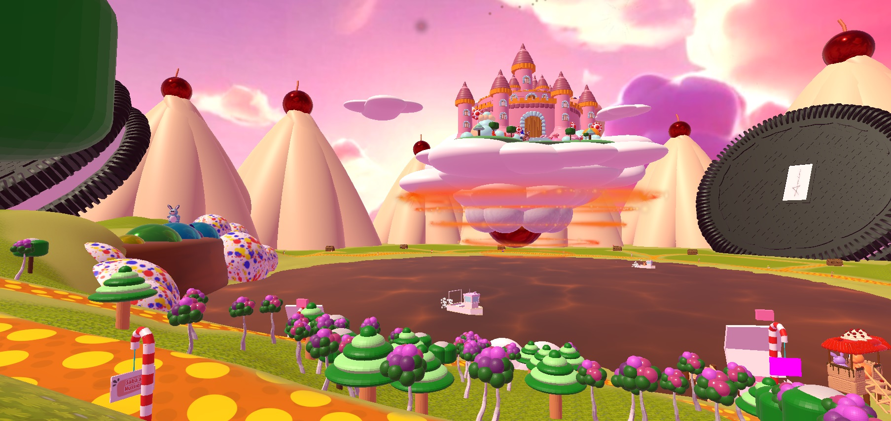
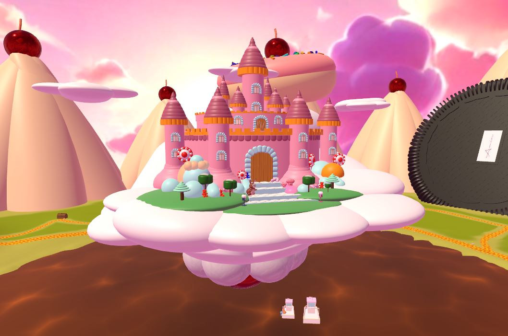
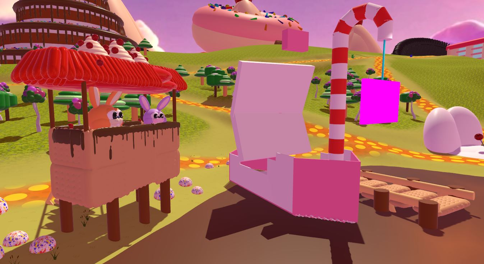
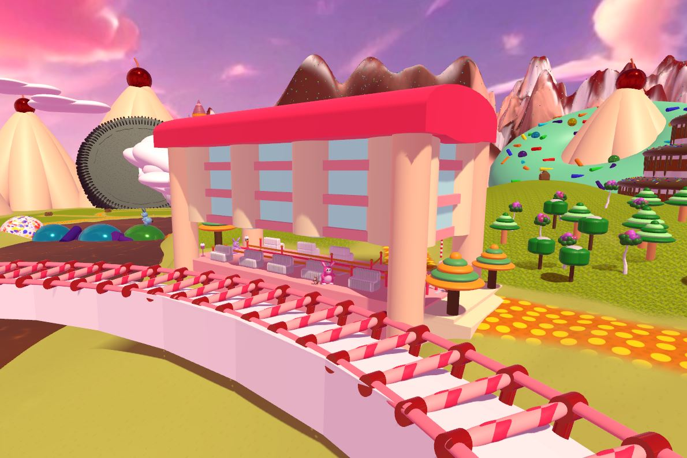
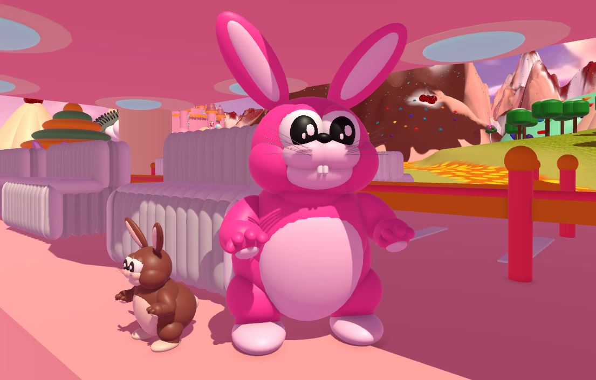

# From me to Mr. Amin 

Thank you, Mmin, for sharing our Unity project! It was a great learning experience creating this small toy game, and I truly appreciate your guidance and support throughout the process. Looking forward to learning more from you!

### here is the link for his beutifull thougths about the project  

 [post is  here ](https://www.linkedin.com/posts/aminabuzahra_students-gift-activity-7285093388515774464-8y2-?utm_source=share&tm_medium=member_desktop)

# Important Note
The core principle of this project is to avoid using any external assets. All models were built using Unity's native shapes, and both the controllers and coding were developed entirely in-house, without relying on any external tools.

# Main Role 
### C# developer , Game Designer , Artist 

# Short Gameplay vedio

# What did i do

## Modling 

- Main Castle 

- Biscuit Watchtower

- Train station

- Bunny
